<div align="center">

# CMA

### Chat Management Application


 </div>

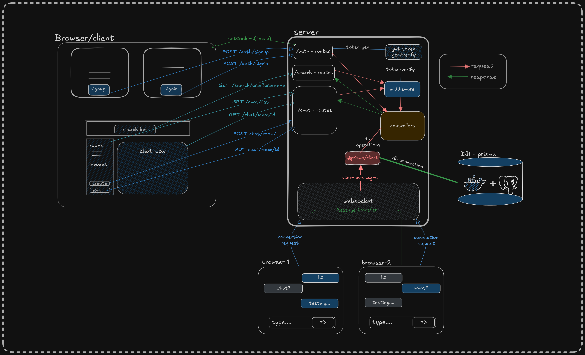

## Features 🧪

#### 🔐 Authentication

- secure user signin/signup with api routes
- successful signin/signup generate `auth token` that will be store on cookies
- all routes are protected, only register user can access chat, create room, join room etc.
- when user logout all cookies will by default

#### 🗪 Real-time Chat System

- Send and receive messages instantly using WebSocket
- Messages are updated live without needing to refresh

#### 👥 Chat Room Functionality

- Users can create public chat rooms with unique names
- Users can join existing rooms by entering the room name
- Messages are visible to everyone in the room
- Each message shows sender name, timestamp, and message content
- when any user is not present in room, message will store on db

#### 📥 Direct Messaging (inbox)

- Debounced search bar for username search, Users can search for other users by username
- Initiate private one-on-one chats
- DM conversations are private between two users

#### </> Message Formatting

- Support for bold (**text**), italic (_text_) and code(`text`) styles using markdown-like syntax

### Run the App locally 🏃

#### 🛠️ install all dependency

```bash
#install dependency
yarn install
```

#### 🔒 Create .env files

```bash
#db's env
cd packages/db/
cp .env.example .env
cd ../..

#server's env
cd apps/server/
cp .env.example .env
cd ../..
```

#### 🐳 connect the db

```bash
#starting the postgres db with docker
docker run --name cmaDB -e POSTGRES_PASSWORD=cmaappadminpassward -p 5432:5432 -d postgres

#migrate db
yarn run db:migrate

#generate client
yarn run db:generate

#optional - show the actual db
yarn run db:show
```

#### 🏃 run all applications

```bash
yarn run dev
```

Now visit the website `localhost:3000`

#### 🔬 **optional** - some predefined credentials for login & testing

```bash
#user 1
username: alice
password: password123

#user 2
username: bob
password: password456

#user 3
username: charlie
password: password789
```

## Demos

#### 1. Landing Page

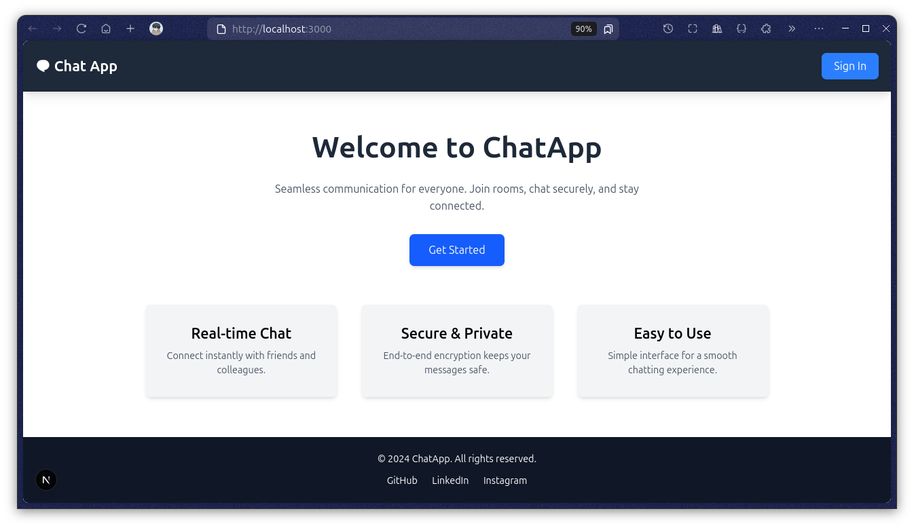

#### 2. Sign up page

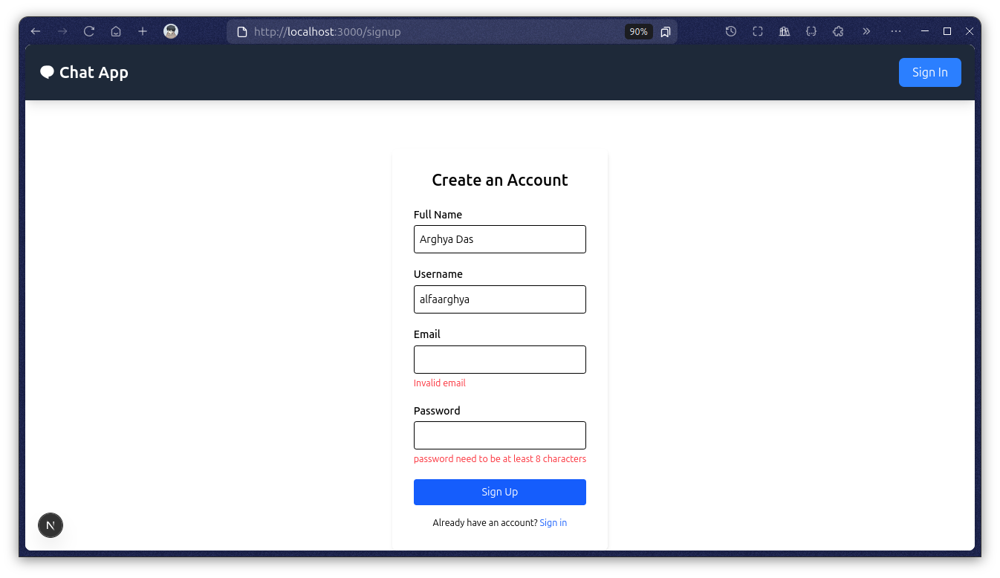
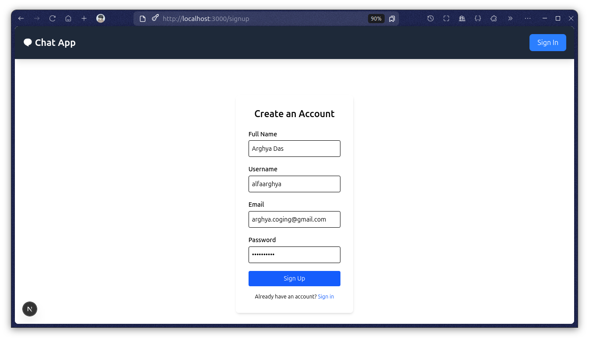

#### 3. Sign in page

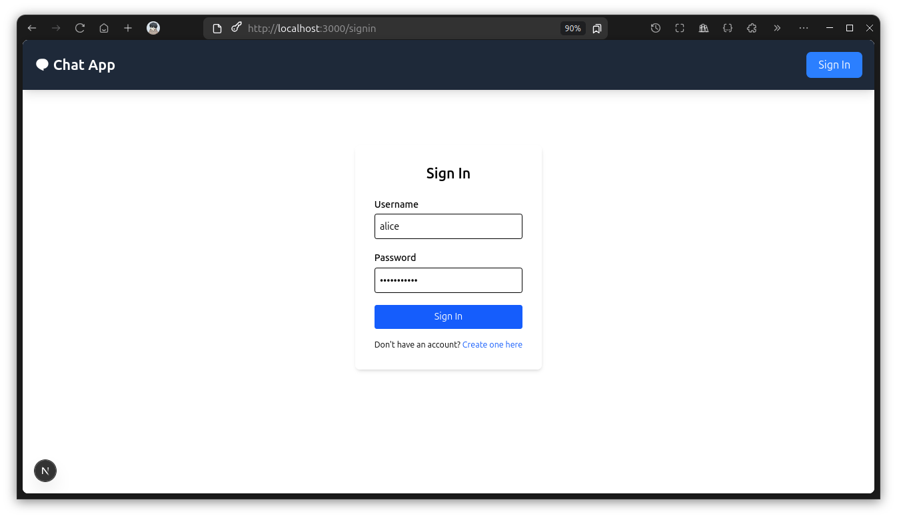

#### 4. Chat page

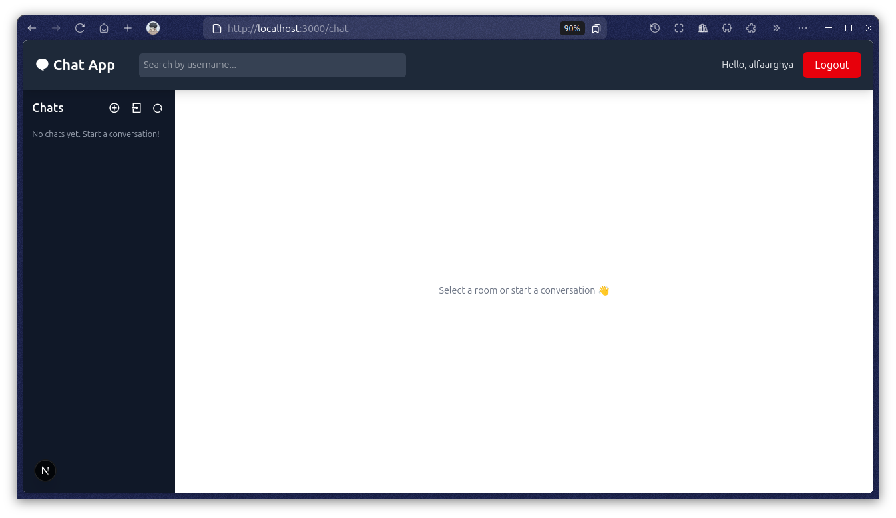

#### 5. create room page

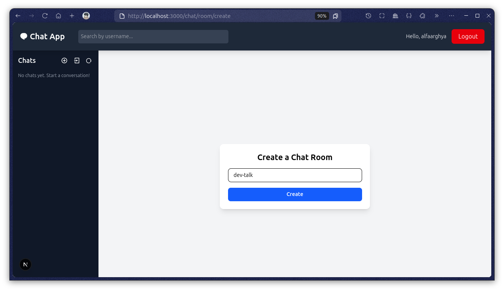

#### 6. join room page

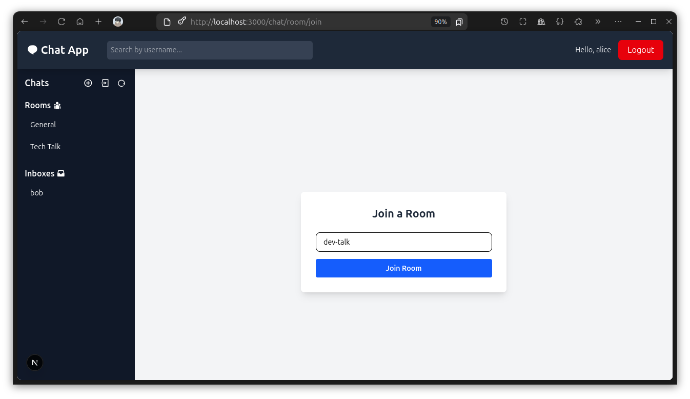

#### 7. room chat page

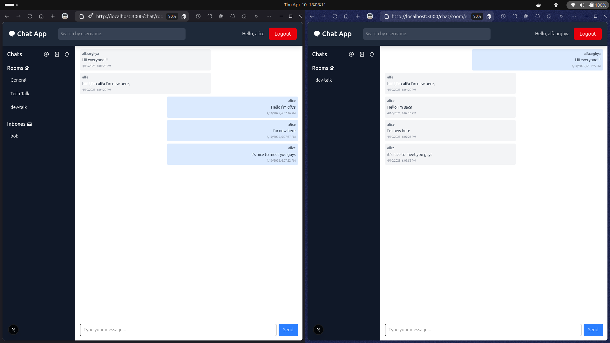

#### 8. Search by username

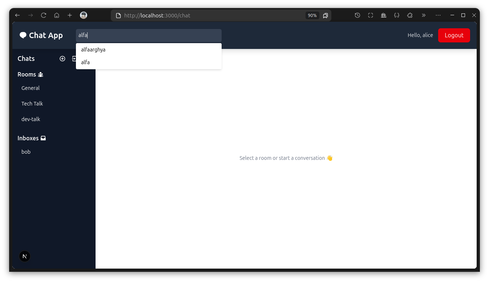

#### 9. inbox chat

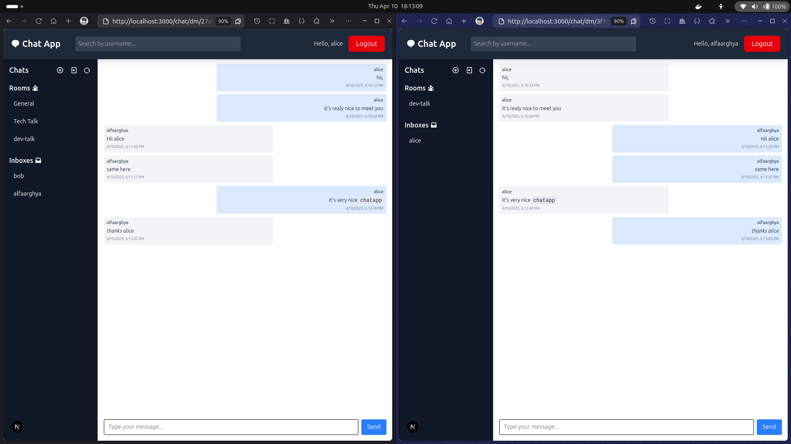
